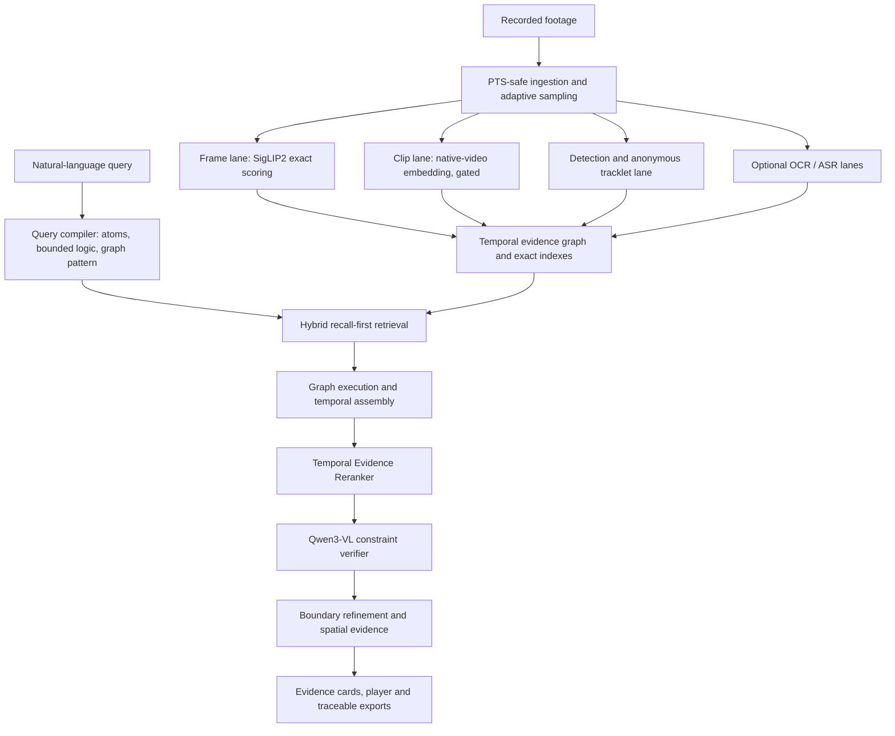
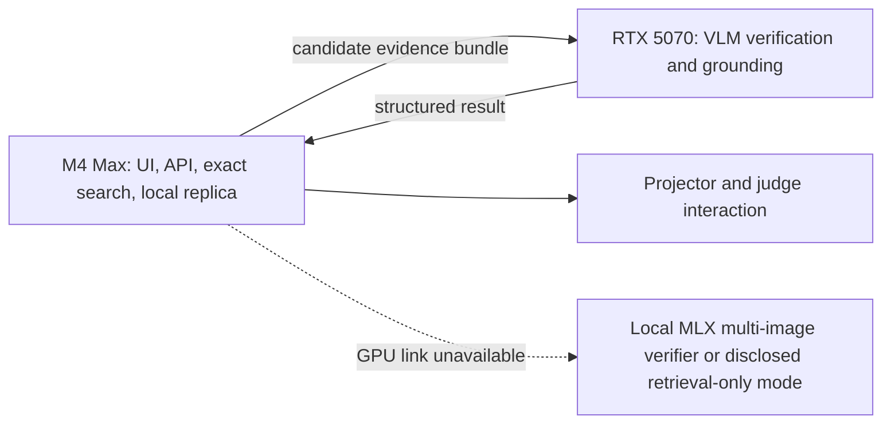

# RAZIEL - Master Execution Plan v1.3

## Local-first temporal evidence intelligence for recorded surveillance footage

**Status:** Proposed execution baseline for a five-person team, four preparation weeks, and a 24-hour hackathon. Architecture changes after the week-three decision point require a measured failure or a measured improvement on the held-out set.

**Name status:** **FROZEN.** The full project is **RAZIEL**. **Eyes of God** is reserved for the retrieval subsystem/mode. The codebase, UI, evaluation outputs, manifests, slides, and demo script must read both names from shared configuration rather than duplicating brand strings.

**v1.2 change:** Corrected the desktop to 32 GB system RAM and 2.5 TB storage; removed the unnecessary RAM/NVMe upgrade recommendation; and isolated branding behind shared configuration. **Naming amendment:** the project name is now frozen as **RAZIEL**, with **Eyes of God** assigned to retrieval. The retrieval/assembly/reranking/verification architecture is unchanged.

**v1.3 change:** Added an archive-wide anonymous tracklet lane, a persistent temporal evidence graph, a graph-pattern query executor, bounded logical queries, and per-atom support heads in the Temporal Evidence Reranker. Replaced the conservative four-week sequence with an aggressive parallel schedule: working baseline by day 3, complete P0 by day 7, advanced architecture in week 2, measured experiments in week 3, and a freeze during the latter half of week 4. The filename and product subtitle now describe **RAZIEL**, not a generic “video retrieval” project.

---

## 1. Mission

**One sentence:** The system searches a declared scope of recorded surveillance footage for zero, one, or multiple moments matching a natural-language description, verifies each stated constraint against visible evidence, returns exact playable clips, and reports what it searched, what it could not assess, and where the system itself failed to decide.

### 1.1 The product thesis

The system is not “a chatbot that watches a video,” and it is not “caption every frame and search the captions.” It is a staged video-retrieval system:

> **Parse → retrieve broadly → assemble temporal evidence → rerank → verify each constraint → refine boundaries → show evidence → export a traceable clip**

This structure is deliberate:

- Retrieval is optimized for recall.
- Verification is optimized for precision and compositional correctness.
- Temporal assembly handles events that span multiple windows.
- Every result exposes evidence and unresolved constraints.
- No-match claims are conditional on declared indexing and verification coverage.
- Expensive models run only on a small candidate set.

### 1.2 What makes the system distinctive

The system evaluates and demonstrates these properties jointly:

1. **Zero/one/many retrieval:** return every system-verified occurrence surfaced at the current operating point, not merely the top result.
2. **Constraint-level verification:** check objects, attributes, actions, locations, relations, and temporal order independently.
3. **Honest abstention:** distinguish footage that is unobservable from a model or pipeline that is undetermined.
4. **Search-completeness reporting:** separate sampling/index coverage, candidate-generation coverage, assembly coverage, and verification coverage.
5. **Traceable extraction:** link each exported clip to its source hash, exact time interval, extraction command, model/config version, and output hash.
6. **Local-first operation:** footage and critical inference stay on the demo machine.
7. **Temporal evidence memory:** frames, clips, detections, anonymous tracklets, text observations, and verified episodes can be queried as a typed time-aware graph rather than isolated search hits.
8. **Measured adaptation:** native-video retrieval, anonymous tracklets, bounded logical execution, spatial grounding, and a trained temporal reranker ship in the primary demo only when their applicable gates pass.
9. **Resilient two-node execution:** exact retrieval, UI, playback, and a searchable evidence replica can remain on the 64 GB M4 Max while the RTX 5070 performs CUDA-heavy verification. Loss of the GPU link degrades verification; it does not erase the archive or kill the demonstration.

---

## 2. Public contract and wording discipline

Every public claim, UI message, slide, and judge answer must reduce to the following:

1. The system searches for zero, one, or multiple supported occurrences within a declared camera/time scope and a declared sampling policy.
2. It reports a state for every required constraint: **supported, contradicted, unobservable, or undetermined**.
3. It distinguishes “the footage does not let us judge this” from “the system failed to decide.”
4. It reports indexing coverage, candidate/assembly completeness, and verification-budget usage separately.
5. It never claims exhaustive event detection, proven absence, certain identity across discontinuous clips, or legal admissibility.

### 2.1 Mandatory phrases

Use:

- “At the current operating point.”
- “All successfully embedded sampling ticks in the declared scope were scored.”
- “No verified match was found.”
- “The supplied footage did not make this attribute assessable.”
- “The system could not determine this constraint.”
- “The search was incomplete because the verification budget was reached.”
- “The manifest is a traceable extraction record.”
- “Measured on our held-out set.”

Do not use:

- “The AI watched every frame.”
- “There is definitely no such event.”
- “Tamper-proof.”
- “Court-admissible.”
- “The same person” across a discontinuous long gap without a supported tracking/re-identification method.
- Confidence percentages that have not been calibrated and evaluated.
- “Negative-aware” to imply support for arbitrary grammatical negation.

### 2.2 Meaning of “negative-aware”

In the baseline, “negative-aware” means:

- the requested event may occur zero times;
- near-matches can be rejected on a failed constraint;
- empty-set query families are evaluated;
- the system can abstain when evidence is insufficient.

The advanced query executor adds only three bounded forms:

- explicit `OR` over a small list of visible alternatives;
- visible absence of an object or attribute within one declared, assessable episode;
- small cardinality constraints over anonymous tracklets within one continuous camera interval.

This does **not** imply arbitrary open-world negation, universal quantification, comparison, or identity reasoning. “Everyone except the guard,” “no vehicle larger than the van,” and similar constructions still route to clarification.

---

## 3. Scope contract

### 3.1 Supported in P0

- Recorded video files from one or more cameras.
- Search filters by video, camera, and time interval.
- Positive conjunctive descriptions of:
  - visible objects;
  - people and vehicles as anonymous entities;
  - visible attributes such as broad colour and clothing type;
  - common actions;
  - simple actor-object relations;
  - visible locations or user-defined zones;
  - before/after event order within the same camera/video;
  - zero, one, or multiple occurrences.
- Short, visually continuous same-actor binding within one episode when the actor remains visibly trackable.
- Per-constraint evidence states.
- Exact playback seek and clip extraction.
- Local operation after models are downloaded.

### 3.2 Parallel advanced capabilities

These exist behind measured gates:

- Motion-densified sampling.
- Native-video/clip embedding retrieval.
- Archive-wide open-vocabulary detections and anonymous per-camera tracklets.
- A persistent temporal evidence graph and graph-pattern executor.
- Bounded visible negation, bounded disjunction, and small-cardinality queries.
- Candidate-only boxes, masks, and track overlays.
- OCR and ASR evidence lanes.
- A trained Temporal Evidence Reranker.
- Higher-resolution retrieval embeddings.
- LoRA adaptation of a reranker or verifier.

These lanes are developed concurrently once the day-three vertical slice exists. They are not delayed until the baseline fails. Their **release status** is gated by correctness, recall, latency, and observability tests.

### 3.3 Explicitly unsupported

- Face recognition or named-person identification.
- Cross-camera identity continuity.
- Long-gap same-person claims within sparse or discontinuous clips.
- Arbitrary or open-world negation, unrestricted Boolean expressions, universal quantifiers, and comparisons.
- Counts that cross cameras, cross discontinuous intervals, exceed the configured bound, or cannot survive track fragmentation/occlusion honestly.
- “Proving” that an event never occurred.
- Real-time alerting over live streams.
- Cross-camera tracking or re-identification.
- End-to-end training of a foundation model.
- Fully automatic forensic/legal conclusions.

When an unsupported construction is central to the query, the system asks one focused clarification before performing expensive work.

---

## 4. Result model

A search result is a vector of independent dimensions, not a single confidence score.

```json
{
  "interpretation": {
    "state": "clear | clarification_required | parser_fallback",
    "atoms": [],
    "relations": [],
    "logic_groups": [],
    "unsupported_constructs": [],
    "clarification_question": null
  },
  "scope": {
    "video_ids": [],
    "camera_ids": [],
    "start_time": null,
    "end_time": null,
    "sampling_policy_version": "..."
  },
  "indexing": {
    "expected_ticks": 0,
    "embedded_ticks": 0,
    "decode_failed_ticks": 0,
    "skipped_ticks": 0,
    "scored_coverage": 0.0
  },
  "candidate_generation": {
    "channels_run": [],
    "qualifying_windows": 0,
    "candidate_recall_operating_point": "benchmark_panel_id",
    "exact_scoring_completed": true
  },
  "graph_execution": {
    "enabled": false,
    "pattern_id": null,
    "tracklets_considered": 0,
    "joins_completed": 0,
    "join_budget_reached": false,
    "observation_scope_assessable": null
  },
  "assembly": {
    "anchor_candidates_qualifying": 0,
    "anchor_candidates_retained": 0,
    "episodes_generated": 0,
    "assembly_complete": true
  },
  "verification": {
    "state": "complete | budget_reached | system_failure",
    "clusters_total": 0,
    "clusters_verified": 0,
    "seconds_used": 0
  },
  "verified_matches": [],
  "unresolved_visual": [],
  "unresolved_system": [],
  "rejected_near_misses": [],
  "archive_conclusion": "verified_matches_found | no_verified_match_at_operating_point | insufficient_visual_evidence | search_incomplete | not_applicable"
}
```

### 4.1 Constraint states

| State | Meaning | Example |
|---|---|---|
| `supported` | Evidence supports the stated constraint | Black bag is clearly visible |
| `contradicted` | Evidence shows the constraint is false | Bag is clearly blue |
| `unobservable` | The footage prevents reliable judgment | Bag is occluded or footage is too dark |
| `undetermined` | The system could not reliably decide | Timeout, invalid response, insufficient supplied context |

### 4.2 Deterministic headline rules

1. `clarification_required` → **CLARIFICATION REQUIRED**
2. One or more verified matches → **N VERIFIED MATCHES FOUND**
3. No matches + complete verification + no unresolved candidates → **NO VERIFIED MATCH AT CURRENT OPERATING POINT**
4. No matches + unresolved visual candidates → **INSUFFICIENT VISUAL EVIDENCE**
5. Any bound verification/assembly budget → append **SEARCH INCOMPLETE**
6. Any unresolved system candidates → append **SYSTEM COULD NOT ASSESS K CANDIDATES**

A budget-truncated search is never rendered as a clean no-match.

---

## 5. RAZIEL system architecture



### 5.1 Architectural hierarchy

**Mandatory core:**

- PTS-safe ingestion.
- Base sampling ledger.
- SigLIP2 frame embeddings.
- Exact complete score computation for every embedded base tick.
- Atom-aware candidate union.
- A minimal temporal evidence graph containing frame, window, and episode nodes even when advanced lanes are disabled.
- Temporal assembly.
- Structured VLM verification.
- Four-state decision layer.
- Evidence clips and coverage reporting.

**Gated improvement 1 - motion densification:**

- Additional sampling around motion/activity.
- Kept if it materially improves action/order candidate recall.

**Gated improvement 2 - native clip retrieval:**

- Qwen3-VL-Embedding-2B or another verified local video-text embedding model.
- Kept only if hardware permits and action/order recall improves enough to justify indexing cost.

**Gated improvement 3 - trained temporal reranker:**

- Small model over frozen features.
- Runs after high-recall candidate generation and before the expensive verifier.
- Ships only after a held-out improvement.

**Gated improvement 4 - spatial evidence:**

- Open-vocabulary detections are generated offline at an adaptive rate and linked into anonymous tracklets within each camera/session.
- Grounding DINO or a faster detector candidate is selected by the day-one hardware benchmark.
- ByteTrack/BoT-SORT-style association is used only for local continuity; a tracklet is not a biometric identity.
- Optional SAM 2 masks are limited to accepted clips.

**Gated improvement 5 - temporal graph and bounded logic:**

- A typed evidence graph persists observable entities and time-scoped relations.
- The parser compiles supported logic to an executable graph pattern.
- `OR`, visible `NOT`, and small counts run only inside formally declared observation intervals.
- If track fragmentation, occlusion, or sampling makes the predicate unsafe, the result is unobservable or undetermined—not a fabricated contradiction.

### 5.2 Architectural advances beyond the reference baseline

The fused design is not the old architecture with more gates. It changes the system in seven material ways:

1. **Dual-resolution evidence path.** Sparse frame embeddings search long archives cheaply; short, denser clips are used only after candidate generation. Retrieval scale and verification quality no longer fight for the same frame rate.
2. **Two complementary retrieval lanes.** Exact SigLIP2 frame scoring covers visible objects and attributes. A gated native clip/video lane targets motion, action, and temporal semantics that static embeddings routinely miss.
3. **Explicit temporal episode construction.** Before/after anchors are joined into typed same-camera episodes before verification, instead of hoping one overlapping window contains an entire event.
4. **Trainable model in the correct position.** The small temporal reranker learns from frozen similarity/motion sequences between recall-first retrieval and the expensive VLM. It can reduce calls and improve boundaries without becoming a single point of failure.
5. **Archive-level anonymous motion memory.** Detection and short-lived per-camera tracklets let the system represent entering, leaving, carrying, co-occurrence, and bounded counting before a VLM call. Track IDs never become person identities.
6. **Persistent temporal evidence graph.** Search outputs become typed nodes and relations with provenance, enabling graph-pattern execution, reusable evidence, and inspectable multi-step temporal reasoning.
7. **Bounded logical execution.** A small auditable algebra supports conjunction, limited alternatives, visible absence, count bounds, and temporal order. Unsupported open-world readings are rejected before inference.

The team builds these advanced lanes in parallel with the reliable core. Gates decide which lanes become part of the primary event configuration; they do not postpone research or reduce the architectural ceiling.

---

## 6. Model roles

| Role | Default | Why | Runtime policy |
|---|---|---|---|
| Frame-text retrieval | `google/siglip2-base-patch16-224` | Fast, multilingual image-text retrieval | Full archive |
| Upgrade frame retrieval | SigLIP2 so400m | Higher-capacity candidate | Only if recall gain justifies memory/latency |
| Clip/video retrieval | `Qwen/Qwen3-VL-Embedding-2B` | Native multimodal/video representation | Gate on hardware + action recall |
| Constraint parser | Qwen3-VL 4B text-only or deterministic fallback | Reuse resident model | One call per query |
| Candidate verifier | `Qwen/Qwen3-VL-4B-Instruct`, quantized | Temporal/spatial reasoning and structured output | Top candidate clusters only |
| Verifier upgrade | Qwen3-VL 8B quantized | Potential precision improvement | Day-one gate only |
| OCR | PaddleOCR | Signage, burned-in text, plates where permitted | Conditional footage lane |
| ASR | faster-whisper | Speech/audio retrieval | Conditional footage lane |
| Object proposals | Grounding DINO or benchmarked lightweight open-vocabulary detector | Queryable object evidence | Offline adaptive-rate lane |
| Anonymous tracking | ByteTrack/BoT-SORT-style association | Local continuity and bounded counts | Per camera/session; no re-ID |
| Spatial evidence | Grounding DINO | Query-conditioned boxes | Verified candidates only |
| Video masks | SAM 2 | Propagate selected object | Stretch; accepted clips only |
| Custom learning | Temporal Evidence Reranker | Domain-specific ranking and boundaries | Shadow mode until gate passes |

### 6.1 Model policy

- No foundation model is trained from scratch.
- Large encoders are frozen.
- Model revision hashes are recorded.
- The core system remains functional if the clip lane, spatial lane, or custom reranker is disabled.
- Only one verifier implementation is primary at demo time.
- Incompatible inference stacks use separate locked environments rather than one fragile environment.

---

## 7. Repository layout

```text
project/
├── README.md
├── packages/
│   └── contracts/
│       ├── video_manifest.py
│       ├── query_plan.py
│       ├── candidates.py
│       ├── verification.py
│       ├── search_result.py
│       └── fixtures/
├── config/
│   ├── default.yaml
│   ├── operating_point.yaml
│   ├── model_registry.yaml
│   └── hardware/
│       ├── rtx5070.yaml
│       ├── m4max.yaml
│       └── rtx5090_cloud.yaml
├── ingest/
│   ├── probe.py
│   ├── hash_source.py
│   ├── sampler.py
│   ├── motion.py
│   ├── quality.py
│   └── windows.py
├── index/
│   ├── frame_embed.py
│   ├── clip_embed.py
│   ├── exact_score.py
│   ├── stores.py
│   ├── detect.py
│   ├── tracklets.py
│   ├── ocr_lane.py
│   └── asr_lane.py
├── evidence/
│   ├── graph_store.py
│   ├── graph_build.py
│   ├── predicates.py
│   └── provenance.py
├── query/
│   ├── schema.py
│   ├── parser.py
│   ├── compiler.py
│   ├── graph_execute.py
│   ├── retrieve.py
│   ├── fuse.py
│   ├── assemble.py
│   ├── rerank.py
│   ├── verify.py
│   ├── boundaries.py
│   └── decide.py
├── grounding/
│   ├── boxes.py
│   └── propagate.py
├── ml/
│   └── temporal_reranker/
│       ├── dataset.py
│       ├── model.py
│       ├── train.py
│       ├── evaluate.py
│       ├── checkpoint.py
│       └── model_card.md
├── output/
│   ├── clips.py
│   ├── manifest.py
│   └── overlays.py
├── api/
│   ├── main.py
│   ├── jobs.py
│   ├── gpu_worker.py
│   └── health.py
├── ui/
│   └── web/
├── data/
│   ├── ledger.md
│   ├── queries/
│   ├── challengers/
│   ├── annotations/
│   └── dataset_card.md
├── eval/
│   ├── baselines.py
│   ├── metrics.py
│   ├── run_eval.py
│   └── reports/
├── tests/
│   ├── unit/
│   ├── integration/
│   └── golden/
├── scripts/
│   ├── day1_bench.py
│   ├── ingest_archive.py
│   ├── sync_demo_replica.sh
│   ├── verify_environment.py
│   └── demo_runbook.md
├── requirements/
│   ├── core.lock
│   ├── verifier.lock
│   └── optional_video_embedding.lock
└── docker-compose.yml
```

---

## 8. Environment and reproducibility

### 8.1 Environments

Use Python 3.11 unless the selected model stack requires otherwise.

Maintain:

1. **Core environment:** ingestion, embeddings, exact scoring, API, evaluation.
2. **Verifier environment:** Qwen3-VL inference and structured output.
3. **Optional clip-embedding environment:** only if native-video retrieval is enabled.
4. **Mac demo environment:** UI, metadata/embedding replica, exact retrieval, playback/export, and a separately tested MLX multi-image verifier fallback.

Do not keep a second inference framework installed merely as an untested fallback. A fallback must have its own lockfile and smoke test.

### 8.2 Contract-first integration

All five workstreams integrate through versioned Pydantic/JSON contracts in `packages/contracts`. The mandatory boundary types are:

| Contract | Producer | Consumers |
|---|---|---|
| `VideoManifest` + `FrameTick` | ingestion | indexing, coverage, export |
| `QueryPlan` | parser | retrieval, assembly, UI |
| `CandidateSet` | retrieval/assembly | reranker, verifier, UI progress |
| `VerificationResult` | GPU worker/verifier | decision layer, evidence UI, evaluation |
| `SearchResult` | decision layer | UI, API, benchmark |
| `ExportManifest` | export service | UI, provenance checks |

Every contract has:

- a schema version;
- a two-minute golden-video fixture;
- representative success, no-match, unobservable, undetermined, and budget-reached JSON fixtures;
- forward-compatible optional fields;
- a contract test that runs in continuous integration.

No workstream imports another workstream’s internal classes. Contract changes require one reviewed pull request containing the schema, migrated fixtures, and consumer tests.

### 8.3 Record

- OS and distribution.
- Python version.
- GPU model and VRAM.
- GPU driver, CUDA and PyTorch.
- FFmpeg and PyAV.
- Transformers/vLLM/SGLang as applicable.
- BitsAndBytes/quantization configuration.
- Exact model repository revision hashes.
- Tokenizer configuration.
- Git commit.
- Operating-point configuration hash.
- Prompt/schema versions.

### 8.4 Offline rule

All critical models, tokenizers, code, wheels if necessary, and demo footage are available before the event. No internet call is on the primary demo path.

---

## 9. Hardware plan, benchmarks, and distributed demo runtime

### 9.1 Fixed and optional compute

| Resource | Status | Role |
|---|---|---|
| Desktop RTX 5070, 12 GB GDDR7 | Fixed; can run continuously | Primary CUDA development, indexing, offline detection/tracklets, reranker training, 4-bit verifier, grounding |
| 64 GB M4 Max | Fixed for the final demo | UI/orchestrator, local archive replica, exact retrieval, playback/export, separately tested MLX fallback |
| RTX 5090, 32 GB GDDR7 | Possible later | Faster ablations, larger batches, 8B verifier/reranker experiments, LoRA sweeps |
| Rented GPU | Optional | Short reproducible experiment jobs; never required by the final live demo |

The RTX 5070 is enough for the complete reliable architecture if models are staged rather than all kept resident. Its 12 GB VRAM means:

- SigLIP2 base indexing and exact retrieval are comfortable.
- Qwen3-VL 4B in 4-bit is the primary verifier candidate.
- Qwen3-VL-Embedding-2B is tested as a separate indexing job, not co-resident with every other model.
- Archive detection/tracklet generation runs offline in resumable video blocks and yields to interactive serving.
- Grounding DINO runs after verification, sequentially.
- The small temporal reranker can be trained repeatedly from cached features.
- Qwen3-VL 8B, SAM 2 propagation, and verifier LoRA remain measured experiments.

Only one large GPU model is assumed resident on the 5070 at a time. The service manager explicitly unloads the embedding/indexing worker before loading the verifier. Do not design a demo that needs the frame encoder, clip encoder, 8B verifier, Grounding DINO, and SAM 2 resident simultaneously.

The desktop’s confirmed **32 GB system RAM and 2.5 TB total storage are sufficient** for the four-week build and the event operating profile. No RAM or storage purchase is required for P0. Continue to:

- memory-map archive embeddings and score them in blocks;
- keep at least 15–20% of the working drive free;
- version and prune reproducible frame caches;
- retain model checkpoints, manifests, and frozen evaluation outputs;
- copy critical checkpoints and the release bundle to the Mac or an external backup.

An external SSD may still be useful for transport and redundant backup, but it is not a compute requirement.

### 9.2 What moves to larger GPUs later

Artifacts move between machines; assumptions do not. Every remote/5090 run uses the same container or lockfile, dataset manifest, config hash, and seed bundle.

| Work | RTX 5070 now | RTX 5090/cloud later |
|---|---|---|
| Core ingestion/retrieval | Build and benchmark | No migration required |
| Temporal reranker | Full training and ablations | Larger sweeps or faster folds |
| Qwen3-VL 4B verifier | Primary path | Re-run reference benchmark |
| Qwen3-VL 8B | Feasibility test only | Full held-out comparison |
| Qwen3-VL-Embedding-2B | Offline indexing test | Faster archive indexing/batching |
| Detector/tracklet lane | Full implementation on adaptive samples | Faster threshold/model sweeps and denser sampling |
| QLoRA/LoRA | Only after the data gate | Multiple controlled runs |
| 32B-class verifier | Not a P0 target | Offline upper-bound experiment only |

A bigger GPU is used to answer a measured question, not to rewrite the system around hardware that may not be present at the venue.

### 9.3 Benchmark discipline

- Cold start reported separately.
- At least 10 warm runs for median.
- At least 20 varied warm runs before reporting p95.
- Result caches bypassed.
- Model weights may remain warm.
- Assert zero result-cache hits.
- Record peak VRAM/RAM and failures.

### 9.4 Tests and gates

| Test | Measurement | Keep condition |
|---|---|---|
| B1: sample + SigLIP2 embed 10 minutes | ingest fps, embed fps, memory | At least 5× real-time preferred |
| B2: Qwen3-VL 4B verify 4/12/30 s candidates | cold/warm latency, retry rate, VRAM | 12 s warm median ≤ 20 s and ≥1.5 GB headroom |
| B3: Qwen3-VL 8B verify | same | Keep only if same gate and held-out semantic gain |
| B4: native clip embeddings | clip indexing rate, memory | Fits and indexes at practical pre-event rate |
| B5: parser | warm median | ≤5 s or use deterministic/parser fallback |
| B6: ten-query end-to-end suite | retrieval latency, verified latency, cache hits | Retrieval feedback ≤3 s; verified result target ≤30 s, hard demo ceiling 60 s |
| B7: detection + tracklets on 10 minutes | processed fps, VRAM, fragmentation, checkpoint/resume | Practical overnight archive rate; no identity claims; resume reproduces artifact hashes |

### 9.5 Operating tiers

**Tier A - dual-lane local**

- Base + motion sampling.
- Frame embeddings.
- Native clip embedding lane.
- Tracklet/temporal-graph lane when its correctness gate passes.
- Qwen3-VL verifier.
- Candidate-only boxes if spatial gate passes.

**Tier B - reliable local**

- Base + optional motion sampling.
- Frame embedding retrieval.
- Qwen3-VL verifier.
- Cited-frame evidence without mandatory boxes.

**Tier C - degraded live**

- Exact retrieval runs live.
- Verification is restricted to user-selected or visibly budgeted candidates.
- UI says search incomplete where applicable.
- Cached results and a recording remain fallbacks, not the primary demonstration.

### 9.6 Preferred final-demo topology

The strongest setup is to bring both the desktop and the Mac and connect them over a dedicated wired LAN. The Mac is the product node; the desktop is an accelerator node.



**M4 Max responsibilities**

- Serve the single-screen UI and public API.
- Hold a synchronized copy of SQLite metadata, frame/clip embeddings, query fixtures, source clips or demo proxies, and all manifests.
- Run exact matrix scoring locally through a platform-specific `ExactScorer` implementation.
- Handle playback, evidence cards, exports, and the metric dashboard without the desktop.
- Run a separately benchmarked MLX multi-image verifier fallback if it meets the minimum semantic and latency gates.

**RTX 5070 responsibilities**

- Serve one versioned `gpu-worker` endpoint for Qwen3-VL verification, dense boundary resampling, and optional grounding.
- Accept only the query plan plus a bounded evidence-frame/clip bundle; the full archive is not transferred per query.
- Return schema-validated `VerificationResult` objects.

**Networking**

- Preferred: gigabit Ethernet through a small travel router/switch, or direct Ethernet with static addresses.
- The application talks to a health-checked HTTP/gRPC worker. SSH is used for process control, logs, and emergency tunneling—not as the user-facing protocol.
- Before every rehearsal, synchronize with checksums and verify matching source, embedding, schema, model, and operating-point hashes.
- If the GPU worker misses its health deadline, the Mac stops submitting calls, marks affected candidates `undetermined`, and offers the tested local fallback or a visibly disclosed retrieval-only mode.

### 9.7 Remote-desktop alternative

Leaving the 5070 desktop elsewhere and SSHing to it is the second-best configuration because venue internet, NAT, power, and home-network failures enter the critical path. If transport is impossible:

- keep the complete searchable demo archive and UI on the Mac;
- establish and rehearse a private tunnel before the event;
- send only candidate evidence bundles to the desktop;
- run the same health/failover logic used on the local LAN;
- keep a remotely controllable power/restart path;
- demonstrate at least one full run with the remote worker deliberately disconnected.

The cloud is an experimental and training resource, not the primary live verifier. A live demo whose only copy of the archive or only search engine is remote is rejected by design.

---

## 10. Data model

SQLite is the canonical metadata store for the prototype. Embeddings are stored in versioned memory-mapped matrices; exact similarity is computed in blocks.

```sql
CREATE TABLE videos (
    video_id TEXT PRIMARY KEY,
    path TEXT NOT NULL,
    camera_id TEXT,
    sha256 TEXT NOT NULL,
    ffprobe_json TEXT NOT NULL,
    recording_start TEXT,
    timebase TEXT,
    duration_s REAL,
    ingested_at TEXT,
    pipeline_version TEXT,
    cache_key TEXT UNIQUE
);

CREATE TABLE sample_ticks (
    video_id TEXT NOT NULL,
    target_pts REAL NOT NULL,
    sampling_lane TEXT NOT NULL CHECK(sampling_lane IN ('base','motion','refine')),
    frame_id INTEGER,
    status TEXT NOT NULL CHECK(status IN ('embedded','decode_failed','skipped')),
    error_code TEXT,
    PRIMARY KEY(video_id, target_pts, sampling_lane)
);

CREATE TABLE frames (
    frame_id INTEGER PRIMARY KEY,
    video_id TEXT NOT NULL,
    pts_seconds REAL NOT NULL,
    sampling_lane TEXT NOT NULL,
    luminance REAL,
    sharpness REAL,
    motion_score REAL,
    decode_ok INTEGER NOT NULL,
    frame_embedding_row INTEGER,
    thumbnail_path TEXT
);

CREATE TABLE windows (
    window_id INTEGER PRIMARY KEY,
    video_id TEXT NOT NULL,
    scale_s INTEGER NOT NULL,
    t0 REAL NOT NULL,
    t1 REAL NOT NULL
);

CREATE TABLE clips (
    clip_id INTEGER PRIMARY KEY,
    video_id TEXT NOT NULL,
    t0 REAL NOT NULL,
    t1 REAL NOT NULL,
    clip_embedding_row INTEGER,
    embedding_model_version TEXT
);

CREATE TABLE detections (
    detection_id INTEGER PRIMARY KEY,
    frame_id INTEGER NOT NULL,
    label TEXT NOT NULL,
    bbox_json TEXT NOT NULL,
    confidence REAL,
    detector_version TEXT NOT NULL,
    FOREIGN KEY(frame_id) REFERENCES frames(frame_id)
);

CREATE TABLE tracklets (
    tracklet_id INTEGER PRIMARY KEY,
    video_id TEXT NOT NULL,
    camera_id TEXT,
    t0 REAL NOT NULL,
    t1 REAL NOT NULL,
    continuity TEXT NOT NULL CHECK(continuity IN ('continuous','interrupted')),
    tracker_version TEXT NOT NULL,
    FOREIGN KEY(video_id) REFERENCES videos(video_id)
);

CREATE TABLE tracklet_detections (
    tracklet_id INTEGER NOT NULL,
    detection_id INTEGER NOT NULL,
    PRIMARY KEY(tracklet_id, detection_id),
    FOREIGN KEY(tracklet_id) REFERENCES tracklets(tracklet_id),
    FOREIGN KEY(detection_id) REFERENCES detections(detection_id)
);

CREATE TABLE evidence_nodes (
    node_id TEXT PRIMARY KEY,
    node_type TEXT NOT NULL CHECK(node_type IN (
        'frame','window','clip','detection','tracklet','ocr','asr','episode'
    )),
    video_id TEXT NOT NULL,
    t0 REAL NOT NULL,
    t1 REAL NOT NULL,
    payload_json TEXT NOT NULL,
    producer_version TEXT NOT NULL
);

CREATE TABLE evidence_edges (
    edge_id TEXT PRIMARY KEY,
    subject_node_id TEXT NOT NULL,
    predicate TEXT NOT NULL CHECK(predicate IN (
        'overlaps','precedes','follows','near','contains',
        'belongs_to_track','carries','enters','exits','co_occurs'
    )),
    object_node_id TEXT NOT NULL,
    t0 REAL,
    t1 REAL,
    evidence_json TEXT NOT NULL,
    producer_version TEXT NOT NULL,
    FOREIGN KEY(subject_node_id) REFERENCES evidence_nodes(node_id),
    FOREIGN KEY(object_node_id) REFERENCES evidence_nodes(node_id)
);

CREATE TABLE ocr_hits (
    ocr_id INTEGER PRIMARY KEY,
    frame_id INTEGER NOT NULL,
    text TEXT NOT NULL,
    confidence REAL,
    bbox_json TEXT
);

CREATE VIRTUAL TABLE ocr_fts USING fts5(
    text,
    content='ocr_hits',
    content_rowid='ocr_id'
);

CREATE TABLE verification_cache (
    cache_key TEXT PRIMARY KEY,
    response_json TEXT NOT NULL,
    created_at TEXT NOT NULL
);

CREATE TABLE exports (
    export_id TEXT PRIMARY KEY,
    search_id TEXT,
    match_json TEXT NOT NULL,
    manifest_json TEXT NOT NULL
);
```

If external-content FTS is used, explicit triggers or rebuild logic must keep `ocr_fts` synchronized.

SQLite remains sufficient: the “graph” is a typed relational representation with indexed time/camera columns and a small pattern executor, not a new Neo4j deployment. Every node and edge records its producer version and evidence reference. Tracklet identifiers are scoped to one camera/session and must never be rendered as real-world identity.

---

## 11. Stage A - ingestion and adaptive sampling

### 11.1 Source processing

For each file:

1. Run FFprobe and store the complete raw result.
2. Stream a SHA-256 source hash.
3. Read frames using presentation timestamps.
4. Never infer time as `frame_index / declared_fps`.
5. Write an expected-tick ledger before embedding.
6. Record decode failures in the denominator.
7. Generate playback thumbnails and a proxy only if needed.
8. Make ingestion restart-safe using:

```text
source hash
+ sampling configuration
+ decoder version
+ preprocessing version
+ embedding model revision
```

### 11.2 Sampling policy

**Base lane:** nearest decodable frame to every 1.0-second PTS tick.

**Motion lane:** while decoding a low-resolution stream, calculate frame difference/optical activity. Around intervals exceeding the development-set motion threshold, add denser ticks, initially up to 4 fps.

**Refinement lane:** after a candidate is accepted for verification, decode 2–4 fps around cited evidence to refine temporal boundaries.

Expected ticks for each active lane are written before decode/embedding so failures remain visible.

### 11.3 Multi-scale windows

Create window views:

- 4 seconds, stride 2.
- 12 seconds, stride 6.
- 30 seconds, stride 15.

For clip embeddings, start with 8- or 12-second overlapping clips. Longer temporal episodes are assembled later instead of relying on one huge embedding window.

### 11.4 Gate G1

- One hour ingests without timestamp regression.
- Restart creates no duplicate ticks.
- Source hash and FFprobe data are present.
- Base coverage denominator matches a hand count.
- A forced decode failure remains in the denominator.

---

## 12. Stage B - multimodal indexing

### 12.1 Frame lane

1. Batch base and enabled motion frames through SigLIP2.
2. L2-normalize embeddings.
3. Append them transactionally to a versioned memory-mapped matrix.
4. Commit metadata only after the embedding block is durable.
5. Record the exact matrix row per frame.

For query scoring, compute:

\[
s = E q
\]

where `E` is the complete normalized frame matrix in the declared scope and `q` is a normalized text vector. Compute in blocks so every embedded tick receives an exact similarity score without loading the whole archive into RAM.

### 12.2 Clip lane

If B4 passes:

1. Create overlapping short clip assets or native video spans.
2. Generate native-video embeddings.
3. L2-normalize and store separately.
4. Score every clip in scope exactly at demo archive scale.
5. Measure action/order recall independently from frame retrieval.

The clip lane is retained only if it adds material held-out recall or reduces candidate volume while maintaining recall.

### 12.3 OCR/ASR lanes

Add only when the supplied footage contains useful text or audio.

- OCR text enters FTS and receives PTS/bounding-box provenance.
- ASR segments receive start/end PTS and language.
- Extracted text is always treated as quoted data, never as model instructions.

### 12.4 Anonymous tracklets and temporal evidence graph

Run detection offline on adaptive sampling ticks, densifying only around motion or ambiguous associations. Associate detections within one camera/session into short anonymous tracklets. Persist:

- bounding boxes and detector scores;
- per-track time span, trajectory, class evidence, and continuity quality;
- frame/window/clip/tracklet/OCR/ASR nodes;
- typed temporal and spatial edges with their originating evidence.

The graph builder is incremental and resumable. Its cache key includes the source hash, sampling policy, detector, tracker, thresholds, and graph-schema version. A detector or tracker change creates a new artifact generation; it never mutates old evidence invisibly.

The 5070 processes this lane in bounded jobs and checkpoints after every video or fixed frame block. Detection/tracking yields to interactive verification through the same GPU lease used by indexing and training.

### 12.5 Gate G2

- Frame embeddings run at the accepted throughput.
- A smoke query retrieves visibly sensible moments.
- Exact score-vector output contains one score per embedded tick.
- Clip-lane indexing, if enabled, is reproducible and versioned.
- Tracklet precision, fragmentation, and count error are measured on a small hand-labeled subset before track-derived predicates are enabled.
- Every graph edge resolves to inspectable source frames and PTS.

---

## 13. Stage C - query understanding

### 13.1 Atom schema

```json
{
  "atom_id": "a3",
  "text_span": "black backpack",
  "type": "object | attribute | action | location | relation | temporal | scene",
  "required": true,
  "visibility_sensitive": true,
  "role": "candidate_anchor | verifier_only | filter | weak_context"
}
```

Top-level schema:

```json
{
  "atoms": [],
  "relations": [
    {
      "relation_id": "r1",
      "subject_atom": "a1",
      "predicate": "carries | near | wears | places | picks_up | follows",
      "object_atom": "a2",
      "required": true
    }
  ],
  "temporal_relations": [
    {
      "first_atom": "a3",
      "relation": "before | after",
      "second_atom": "a4",
      "max_gap_s": 600,
      "same_actor_required": false
    }
  ],
  "logic_groups": [
    {
      "group_id": "g1",
      "operator": "all | any | visible_none | count",
      "atom_ids": ["a1", "a2"],
      "observation_scope": "candidate_episode",
      "min_count": null,
      "max_count": null
    }
  ],
  "filters": {},
  "ambiguities": [],
  "unsupported_constructs": [],
  "clarification_question": null
}
```

### 13.2 Parser rules

- Every atom must quote or map directly to a span in the request.
- The parser cannot invent attributes.
- Explicit constraints remain required.
- “Maybe” produces ambiguity, not automatic optionality.
- Relations do not become independent object claims.
- Long queries are parsed before embedding; individual atoms avoid tokenizer truncation.
- The supported logical algebra is explicit: `all`, bounded `any`, `visible_none`, and bounded `count`.
- `visible_none` is legal only inside a camera/time/episode interval where the target region is assessable; otherwise the constraint is `unobservable`.
- Counts are over tracklets whose time overlap and continuity meet configured rules, never raw boxes or cross-camera identities.
- Unsupported grammar or an unbounded/open-world reading produces one focused clarification.
- Long-gap `same_actor_required=true` is rejected before retrieval with an order-only alternative.

The compiler converts the validated plan into a graph pattern plus semantic-retrieval anchors. The LLM never emits SQL. The executor supports a fixed predicate registry, parameterized queries, bounded joins, and a trace that names every node/edge used in the result.

### 13.3 Failure handling

1. Schema validation.
2. One retry with validation errors.
3. Deterministic fallback:
   - preserve time/camera filters;
   - use whole query plus simple noun/adjective/action phrase extraction;
   - mark `parser_fallback`.
4. UI renders parsed chips before expensive work.

### 13.4 Gate G3

At least 25 scripted queries:

- object;
- attribute;
- action;
- binding;
- temporal;
- multi-occurrence;
- absent;
- ambiguous;
- supported bounded `OR`, visible absence, and small count;
- unsupported open-world negation/universal/comparative logic;
- long-gap identity request.

Target at least 80% fully correct parses, with every failure visible and survivable.

---

## 14. Stage D - recall-first hybrid retrieval

### 14.1 Retrieval channels

For each query:

1. Whole-query frame channel.
2. Candidate-anchor atom frame channels.
3. Rare-attribute frame channels.
4. Native clip channel if enabled.
5. Detection/tracklet channel for objects, trajectories, zones, co-occurrence, and bounded counts.
6. Temporal graph-pattern channel for typed relations and supported logic.
7. OCR exact/full-text channel if enabled.
8. ASR channel if enabled.
9. Filter channel for time/camera/zone.

### 14.2 Frame-window aggregation

For each channel, aggregate complete frame-score sequences into windows using:

- maximum;
- mean;
- top-20%-mean;
- persistence count above a frame threshold.

Choose the default through development-set ablation. Start with top-20%-mean.

### 14.3 Candidate existence and ordering

Order of operations:

1. Aggregate every channel.
2. Apply channel-specific development thresholds.
3. Every above-threshold window becomes a qualifying candidate.
4. Union qualifying windows across channels.
5. Use Reciprocal Rank Fusion only to prioritize verification order.
6. Do not let RRF silently remove a qualifying candidate.
7. Cluster overlapping/adjacent windows while preserving members.
8. Report any later truncation as incomplete verification.

Graph execution is a candidate-generation and evidence-assembly channel, not an oracle. Positive graph predicates can create candidates. `visible_none` and `count` become deciding constraints only when the expected observation ticks are present and the relevant region is assessable. Track fragmentation beyond the configured tolerance produces `undetermined`; occlusion or darkness produces `unobservable`.

### 14.4 Threshold tuning

Tune for high candidate recall under a visible verification budget. Report:

- overall interval recall;
- complete-set query recall;
- action/order recall;
- median qualifying windows;
- median clusters;
- recall within the actual verification budget;
- verifier calls per query.

The target is at least 95% candidate recall on development data where feasible. If action/order recall materially lags:

1. enable/tune motion densification;
2. test native clip embeddings;
3. keep the simplest lane combination that fixes the measured failure.

Track/graph thresholds are tuned separately from semantic similarity. Report track fragmentation, duplicate-track rate, count error, graph-pattern recall, and additional candidates per query. A graph candidate is unioned with every qualifying semantic candidate; it must not suppress frame/clip evidence.

### 14.5 Gate G4

- Candidate recall measured on the initial development set.
- Action/order subset reported separately.
- Every expected frame score is accounted for.
- Candidate volume fits a declared verification budget or the UI visibly reports truncation.
- Bounded logic fixtures return the correct candidates and the correct unresolved state under occlusion/fragmentation.

---

## 15. Stage E - temporal assembly

Some descriptions require multiple moments:

> “A person enters near the gate, then later leaves carrying a bag.”

No single short window may contain both events.

### 15.1 Assembly procedure

1. Build a timeline of all threshold-qualified candidates for each anchor atom.
2. Attach qualifying frame, clip, tracklet, OCR/ASR, and zone nodes from the evidence graph.
3. Join only within the same video and camera.
4. Enforce before/after order, graph predicates, supported logic, and configured maximum gap.
5. Do not infer same identity across discontinuous gaps.
6. Keep all anchor candidates at demo archive scale.
7. Apply a disclosed maximum episode count only after joining.
8. Emit the exact graph-pattern trace used to construct each episode.
9. Send each assembled episode to reranking/verification with labeled subsegments.

### 15.2 Completeness record

```json
{
  "anchor_candidates_qualifying": 18,
  "anchor_candidates_retained": 18,
  "assemblies_generated": 9,
  "episode_cap_bound": false,
  "assembly_complete": true
}
```

If any qualifying anchor is dropped or an episode cap binds, no clean no-match conclusion is allowed.

### 15.3 Gate G5

Use a staged event:

- entrance event at `t`;
- exit-with-bag event several minutes later;
- wrong-order decoy;
- separate actors in a wrong-binding decoy.

The correct episode must assemble; wrong order must be contradicted; long-gap identity must not be claimed.

---

## 16. Stage F - Temporal Evidence Reranker

The custom model is an enhancement, not a dependency.

### 16.1 Purpose

Given a query and a retrieved candidate episode, predict:

- candidate relevance;
- per-atom support logits;
- relation and bounded-logic support logits;
- evidence-frame relevance;
- event start distribution;
- event end distribution;
- evidence-completeness score.

It should reduce expensive VLM calls and improve temporal ordering without replacing the verifier.

### 16.2 Inputs

For each candidate:

- SigLIP2 query-to-frame similarity sequence.
- Per-atom similarity sequences.
- Native clip similarity if enabled.
- Window scale and relative timestamps.
- Motion/activity sequence.
- Luminance/sharpness/missing-frame flags.
- OCR/ASR match indicators when enabled.
- Parsed temporal-relation features.
- Tracklet trajectories, continuity flags, object/zone relations, and graph-predicate features.

Large visual encoders remain frozen; their features are precomputed.

### 16.3 Architecture

A small model:

- projection of query/channel features to a shared hidden size;
- two-layer temporal transformer or bidirectional GRU;
- relative time encoding;
- candidate relevance head;
- per-atom support head with masks for variable atom counts;
- optional relation/logic support head;
- start/end heads;
- optional evidence-completeness head.

Target trainable size: small enough to train quickly on one consumer GPU or CPU using precomputed features.

### 16.4 Training data gate

Do not train until there are at least:

- 150 independent labeled candidate episodes, not merely paraphrase variants;
- positive and absent examples;
- wrong-attribute, wrong-binding, wrong-order, partial-event, and unobservable challengers;
- track fragmentation, bounded-OR, visible-absence, and bounded-count challengers for any corresponding head that will ship;
- grouped train/dev/test splits by scenario/session;
- enough examples per major challenger family to report a confusion table.

### 16.5 Loss

\[
L =
L_{\text{pairwise-rank}}
+ \lambda_1 L_{\text{start}}
+ \lambda_2 L_{\text{end}}
+ \lambda_3 L_{\text{frame-relevance}}
+ \lambda_4 L_{\text{atom-support}}
+ \lambda_5 L_{\text{relation-support}}
\]

Start with ranking, boundaries, and atom support. Enable the relation/logic loss only when the corresponding labeled examples clear the data gate. Reranker outputs are prioritization and verifier hints; they never replace the four-state evidence verdict.

### 16.6 Ship gate

Run in shadow mode. Enable by default only if held-out evaluation shows one of:

- at least a 3-point absolute improvement in temporal set F1; or
- at least 25% fewer VLM verification calls at the same candidate recall;

and:

- rejection F1 does not decrease materially;
- required-condition macro-F1 does not decrease and per-atom support improves or remains neutral;
- complete-set recall does not decrease;
- inference adds less than one second per query on the demo machine;
- failure falls back to baseline RRF ordering.

If the gate fails, report it as an experiment and keep it disabled. This is still a valid scientific result.

### 16.7 Resumable 24/7 training

The 5070 desktop is treated as a preemptible worker even when it is physically reliable. Every training run is restartable without silently changing the experiment.

An exclusive GPU lease has three modes: `index`, `train`, or `serve`. Only one memory-heavy mode runs at once. The local job registry queues experiments; an interactive development request can ask the trainer to checkpoint and yield, after which `--resume auto` continues it. A service supervisor restarts failed jobs, while a watchdog records GPU memory/temperature, host RAM, disk space, exit codes, and checkpoint age. Use stock clocks and verify cooling and storage health before unattended runs.

**Checkpoint contents**

- model weights;
- optimizer and learning-rate scheduler;
- AMP gradient-scaler state;
- epoch, global step, microbatch and gradient-accumulation position;
- deterministic sampler epoch/offset;
- Python, NumPy, PyTorch CPU, and CUDA RNG states;
- resolved config and command line;
- Git commit and dirty-state flag;
- dataset-manifest hash, split hash, feature-cache version, and model-revision hashes;
- best metric, early-stopping state, and evaluation history.

**Write policy**

- Save every 10–15 minutes or fixed `N` optimizer steps, whichever occurs first.
- Write to a temporary file, flush, then atomically replace `last.ckpt`.
- Keep `best.ckpt`, `last.ckpt`, the last three numbered checkpoints, and milestone checkpoints.
- Handle `SIGINT`/`SIGTERM` by finishing the current optimizer step, saving a checkpoint, updating the run ledger, and exiting.
- Verify a checkpoint by loading it in a clean process before deleting an older milestone.

**Resume policy**

- `train.py --resume auto` finds and validates `last.ckpt`.
- Resume is refused on dataset/split/feature-schema mismatch unless an explicit migration is recorded.
- A resumed run retains the same immutable run ID; a changed hyperparameter creates a child run.
- Metrics are logged locally to TensorBoard or MLflow with a SQLite run registry; cloud logging is optional.
- Checkpoints, configs, the run registry, and model cards are copied off the desktop daily. Raw frame caches need not be backed up if reproducible from hashed sources.

The same checkpoint format is used on the 5070, 5090, and rented GPUs. Device and precision changes are recorded as a new child run, not hidden inside a continuation.

### 16.8 LoRA policy

LoRA on Qwen3-VL or Qwen3-VL-Reranker is stretch-only. It requires substantially more clean data than the minimum dataset and must outperform the unchanged model on a grouped held-out split. It is never attempted merely to say that a foundation model was fine-tuned.

---

## 17. Stage G - structured verification

### 17.1 Input

One candidate cluster or assembled episode per call:

- 8–24 selected frames depending on duration and hardware;
- every frame labeled with `frame_id` and source PTS;
- labeled subsegments for assembled episodes;
- atom and relation schema;
- footage-quality signals as metadata, not verdicts.

For short clips, denser frame sampling is allowed. Longer candidates use coverage-aware frame selection and may receive a focused second pass.

### 17.2 Verifier output

```json
{
  "atoms": [
    {
      "atom_id": "a3",
      "state": "supported | contradicted | unobservable | undetermined",
      "reason_code": "visible_match | visible_mismatch | occlusion | low_light | out_of_frame | insufficient_context | inconsistent_output | timeout | model_error",
      "evidence_frame_ids": [123, 127],
      "rationale": "One concise model rationale"
    }
  ],
  "relations": [],
  "matching_subintervals": [
    {
      "start_frame_id": 120,
      "end_frame_id": 132
    }
  ]
}
```

### 17.3 Decision discipline

- The verifier decides observability per candidate and per constraint.
- Code verifies every cited frame ID exists.
- Code maps IDs to PTS; the model never performs authoritative timestamp arithmetic.
- Invalid output retries once.
- `undetermined` with remediable reasons receives one targeted recovery:
  - resample additional context for `insufficient_context`;
  - re-ask with valid IDs for inconsistent references;
  - retry once for transient timeout.
- Unrecovered `undetermined` remains unresolved system evidence.
- A contradicted required constraint rejects the candidate.
- All required constraints supported produces a verified match.

### 17.4 Boundary refinement

For accepted candidates:

1. Decode densely around proposed start/end evidence.
2. Re-evaluate event onset/offset using frame relevance and/or a focused verifier call.
3. Map selected frames deterministically to PTS.
4. Add configurable pre/post padding.
5. Report measured boundary error.

### 17.5 Verification cache

Cache key includes:

- source hash;
- exact frame IDs and PTS list;
- candidate bounds;
- model revision;
- quantization;
- prompt/schema version;
- decoding parameters;
- pipeline version;
- operating-point configuration hash.

### 17.6 Gate G6

On a labeled verifier set:

- required-condition semantic macro-F1 target ≥0.70;
- report supported/contradicted/unobservable confusion matrix;
- report undetermined rate by reason;
- black-versus-blue decoy contradicts colour;
- dark/occluded clip becomes unobservable;
- wrong binding contradicts relation;
- forced timeout becomes undetermined;
- cited IDs are valid.

If structured single-call quality fails, use focused per-atom calls for decision-critical constraints.

---

## 18. Stage H - candidate-only spatial evidence

Spatial grounding is a visual enhancement and an evidence check, not the retrieval backbone.

### 18.1 Procedure

For verified candidates only:

1. Extract object nouns and referring phrases from supported atoms.
2. Run Grounding DINO on cited evidence frames.
3. Validate that a grounded region exists for evidence-sensitive claims.
4. Optionally propagate boxes/masks through the short accepted interval with SAM 2 or a lightweight tracker.
5. Render overlays in the player.

### 18.2 Honest fallback

If spatial grounding:

- does not fit;
- adds too much latency;
- produces unstable boxes;
- conflicts with the verifier;

then show cited frames without boxes. Do not display decorative inaccurate overlays.

### 18.3 Gate G7

On at least 20 supported object/attribute evidence instances:

- grounded region corresponds to the cited object;
- no grossly incorrect boxes are shown;
- overlay latency fits the demo;
- turning the lane off does not affect the core verdict.

---

## 19. Stage I - decision layer and evidence cards

### 19.1 Candidate verdict

- All required atoms/relations supported → verified match.
- Any required constraint contradicted → rejected near-match.
- No contradiction + at least one required unobservable → unresolved visual.
- No contradiction + at least one required undetermined → unresolved system.

### 19.2 Evidence card

Each card shows:

- camera/video;
- absolute and relative interval;
- cited thumbnail strip;
- per-constraint state;
- one-line model rationale, labeled as such;
- inspectable frame IDs/PTS;
- retrieval lanes that surfaced the candidate;
- graph predicates and anonymous tracklet fragments used, when applicable;
- boundary padding;
- playback button;
- preview export;
- evidence export;
- optional spatial overlay.

No uncalibrated “93% confidence” badge.

### 19.3 Near misses

Keep the strongest rejected near-matches collapsible. They are valuable because they show why a semantically similar result failed:

> “Person leaves a bag” supported; “black bag” contradicted because the bag is blue.

---

## 20. Output and traceable extraction

### 20.1 Preview clip

Fast stream-copy extraction. It may align to a nearby keyframe and is labeled as preview.

### 20.2 Evidence clip

Re-encode the accepted interval for accurate requested boundaries. Include measured actual start/end.

### 20.3 Manifest

Record:

- source file ID and camera ID;
- source SHA-256;
- requested start/end PTS;
- actual output start/end;
- context padding;
- extraction mode;
- exact FFmpeg command;
- FFmpeg version;
- source timebase;
- operating-point config hash;
- pipeline Git commit;
- model revision identifiers;
- creation timestamp;
- output clip SHA-256;
- manifest SHA-256.

Compute the manifest hash over canonical JSON with the manifest-hash field omitted.

Framing:

> “The manifest provides a traceable extraction record linking the exported clip to its source, selected interval, extraction environment, and exact command.”

No legal-admissibility claim is made.

### 20.4 Gate G8

- Preview and evidence exports work.
- Evidence first frame is within the measured extraction tolerance.
- Source and output hashes verify.
- Manifest canonical-hash test passes.

---

## 21. Dataset and annotation plan

Dataset generation is a primary project contribution.

### 21.1 Ledger first

Before threshold tuning:

1. Watch the available footage in full.
2. Write one ledger entry for every notable event.
3. Record:
   - camera;
   - start/end;
   - actors as anonymous IDs;
   - objects;
   - actions;
   - relations;
   - lighting/occlusion;
   - repeated occurrences;
   - confusable events.

The ledger, not retrieval output, is the ground-truth backbone.

### 21.2 Staged footage

If organizer footage is late or unsuitable, record fixed-camera footage with consenting participants:

- repeated event with at least three occurrences;
- black-bag positive;
- blue-bag wrong-attribute decoy;
- wrong-binding decoy;
- wrong-order decoy;
- partial-event decoy;
- dark or occluded unobservable segment;
- true empty-set query;
- cross-window temporal event.
- two/three-person bounded-count scenes with deliberate track occlusion;
- bounded-OR alternatives;
- a visible-absence scene with an assessable interval and an occluded counterpart.

### 21.3 Query families

Commitment:

- initial development set: 15–20 base families;
- minimum final set: 40 families;
- target: 60–80 families;
- stretch: 100+ only if annotation quality remains high.

Each family contains:

- canonical query;
- two independently written paraphrases;
- declared search scope;
- zero/one/many ground-truth intervals;
- atom/relation labels;
- typed challengers;
- assessability labels;
- boundary labels.

Variants are not counted as independent families.

### 21.4 Challenger types

- wrong attribute;
- wrong object;
- wrong binding;
- wrong order;
- partial event;
- short interruption mistaken for abandonment;
- visually similar actor;
- unobservable;
- true no-event;
- repeated events.
- track fragmentation and duplicate-track decoys;
- bounded disjunction;
- visible absence in assessable and unassessable intervals;
- correct and incorrect bounded counts.

### 21.5 Split discipline

- Split by scenario/session, not adjacent windows or file names.
- Keep staged and organizer pools separate.
- Test ground truth never comes from retriever proposals.
- Empty-set labels require full human review of the declared scope.
- Auto-proposals can accelerate development annotation but not define test truth.

### 21.6 Agreement

Blind double annotation of at least 20%:

- present/absent agreement;
- atom-state agreement;
- relation agreement;
- temporal boundary IoU.

Adjudicate after independent labels are recorded.

### 21.7 Dataset card

Publish:

- pool/session counts;
- query/challenger distribution;
- annotation protocol;
- split policy;
- agreement;
- known biases;
- staged versus organizer provenance;
- footage authorization status;
- limitations.

### 21.8 Gate G9

- Ledger complete.
- Minimum 40 base families.
- Challenger coverage present.
- Independent agreement subset complete.
- Evaluation script runs end to end.

---

## 22. Evaluation

### 22.1 Primary dashboard

1. **Candidate recall**
   - interval candidate recall;
   - complete-set query recall;
   - overall and action/order subset;
   - recall inside the actual verification budget.

2. **Temporal set precision/recall/F1**
   - one-to-one matching;
   - t-IoU threshold declared, initially 0.5.

3. **Empty-set rejection F1**
   - correct no-verified-match outcome on reviewed absent families.

4. **Required-condition semantic macro-F1**
   - ground-truth classes: supported, contradicted, unobservable;
   - undetermined predictions count as unresolved/incorrect;
   - separate system-undetermined rate and reason breakdown.

5. **Boundary error**
   - median absolute start error;
   - median absolute end error;
   - combined error.

6. **Latency and efficiency**
   - retrieval median/p95;
   - verification median/p95;
   - uncached end-to-end median/p95;
   - candidates/clusters and VLM calls per query;
   - indexing throughput.

7. **Coverage**
   - sampled-tick coverage;
   - assembly completeness;
   - verification completeness.

8. **Spatial evidence quality**, only if enabled
   - evidence-box validity on a labeled sample;
   - overlay failure rate.

9. **Track and graph quality**, only if enabled
   - track fragmentation and duplicate-track rate;
   - count absolute error;
   - graph-pattern candidate recall;
   - edge-evidence validity on a labeled sample.

10. **Bounded-logic correctness**, only if enabled
   - exact outcome by operator (`any`, `visible_none`, `count`);
   - unobservable/undetermined rate under occlusion and fragmentation;
   - zero false clean-negatives caused by missing observation coverage.

### 22.2 Baselines

All use the same declared candidate/verification budget:

- **B1:** whole-query SigLIP2 frame retrieval.
- **B2:** atom-union retrieval without per-constraint verification.
- **B3:** B2 plus one whole-query VLM yes/no per candidate.
- **FULL:** atom union + optional clip lane + assembly + constraint verifier.
- **FULL+GRAPH:** FULL + tracklet/temporal-graph candidates and bounded-logic execution.
- **FULL+STR:** FULL with trained temporal reranker, only if trained.

### 22.3 Ablations

In priority order:

1. max vs mean vs top-20%-mean vs persistence aggregation;
2. whole-query vs atom-union retrieval;
3. base sampling vs motion densification;
4. frame lane vs frame+clip lane;
5. no assembly vs temporal assembly;
6. whole-query verifier vs structured constraint verifier;
7. structured single call vs focused per-atom recovery;
8. semantic-only vs semantic+track/graph union;
9. candidate-only grounding vs archive tracklet memory;
10. bounded logic disabled vs enabled on its supported subset;
11. RRF ordering vs trained temporal reranker;
12. reranker relevance-only vs relevance+per-atom heads;
13. base vs larger SigLIP2.

### 22.4 Benchmark panel

The UI links no-match conclusions to measured aggregate context:

```text
Held-out benchmark, config <hash>, evaluated <date>
Interval candidate recall: x/y
Complete-set positive-query recall: a/b
Empty-set rejection F1: ...
System undetermined rate: ...
These are aggregate held-out measurements, not query-specific probabilities.
```

Until measured, display “not yet measured.”

---

## 23. API contracts

- `POST /ingest`
  - source path, camera ID, recording start;
  - returns job ID.

- `GET /ingest/{job_id}`
  - progress by source;
  - expected/embedded/failed ticks;
  - detection, tracklet, and graph-generation checkpoints;
  - model/config revisions.

- `POST /query`
  - text;
  - camera/time scope;
  - disclosed optional budgets;
  - returns parsed intent immediately and streams progress.

- `GET /query/{search_id}`
  - full result vector;
  - verified/unresolved/rejected candidates;
  - coverage;
  - compiled graph pattern and evidence trace when enabled.

- `POST /export`
  - match ID;
  - preview/evidence;
  - optional redaction/overlay.

- `GET /coverage`
  - indexing, assembly and verification coverage for a scope.

- `GET /benchmark/current`
  - current held-out panel and configuration hash.

---

## 24. Single-screen UI

### 24.1 Header

- **RAZIEL** wordmark from the shared product-name constant.
- Optional secondary status label: **Eyes of God retrieval active**.
- Local/offline indicator.
- Current archive duration.
- Current operating-point label.
- Index health.

### 24.2 Search bar

- Natural-language prompt.
- Camera/time filters.
- Example queries.
- Visible scope statement.

### 24.3 Parsed intent

Editable chips:

```text
PERSON ×  RED UPPER CLOTHING ×  BLACK BAG ×
PLACES BAG ×  NEAR GATE ×  THEN WALKS AWAY ×
```

Unsupported constructs and clarification appear here before expensive work.

### 24.4 Progress

Stream:

- scope resolved;
- all indexed ticks scored;
- qualifying windows;
- episodes assembled;
- clusters verified;
- budget remaining.

The user should see useful retrieval feedback within a few seconds even if verification continues.

### 24.5 Result timeline

- Camera lanes.
- Verified matches.
- Unresolved candidates.
- Rejected near-misses.
- Selected interval.
- Sampling/coverage gaps.

### 24.6 Player and evidence drawer

- Seek to match.
- Frame stepping.
- Cited evidence markers.
- Optional boxes/masks.
- Per-constraint states.
- Model rationale labeled as such.
- Preview/evidence export.
- Manifest view.

### 24.7 Headline examples

> **3 VERIFIED MATCHES FOUND**  
> All embedded ticks in the selected 2-hour scope were scored. 12/12 candidate clusters were verified.

> **NO VERIFIED MATCH AT CURRENT OPERATING POINT**  
> A blue-bag near-match was rejected because “black bag” was contradicted. See held-out benchmark context.

> **INSUFFICIENT VISUAL EVIDENCE**  
> One candidate could not be resolved because bag colour was occluded.

> **SEARCH INCOMPLETE**  
> 17/31 candidate clusters were verified before the declared budget was reached.

---

## 25. Build sequence and acceptance gates

The team has four preparation weeks. The event itself is for adaptation, integration, evidence, and presentation—not for inventing the architecture.

### 25.1 Four-week preparation calendar

Five capable members using coding agents should not spend two weeks rediscovering the baseline. The plan therefore separates **construction speed** from **release confidence**: advanced work starts as soon as the day-three slice runs, while the known-good configuration remains continuously demoable.

| Window | M1: video memory | M2: query intelligence | M3: learning/verification | M4: data/science | M5: product/release | Exit test |
|---|---|---|---|---|---|---|
| **Days 1–3: working baseline** | PTS ingest, hashes, tick ledger, SigLIP2 embed/exact-score CLI | schema, deterministic parser fallback, whole-query + atom retrieval | benchmark/select 4B stack; structured verifier fixture and GPU-worker stub | staged ledger, first 20 families, B1 metric skeleton | contracts/CI, FastAPI shell, player, mocked then real result card | One command ingests; one query returns candidates; one candidate verifies and plays in the UI |
| **Days 4–7: complete reliable P0** | resumable indexing, coverage, cache keys, motion signal | union/threshold/RRF, clustering, cross-window assembler | retries, four states, boundaries, cache, evidence-frame validation | 40 families, challenger set, B1/B2/FULL harness | real job progress, timeline, export/manifest, PC/Mac service skeleton | Positive, repeated, near-match, no-match, unobservable, timeout, wrong-order, and export cases pass end to end |
| **Week 2: advanced architecture** | adaptive detector, anonymous tracklets, incremental evidence-graph builder | logic schema/compiler, graph-pattern executor, graph/semantic candidate union | reranker feature cache, per-atom heads, verifier/grounding ablations | 60–80 families; label track/logic challengers; graph/count metrics | graph-trace drawer, toggles, two-node runtime, search-state recovery | Tracklet and graph lanes run in shadow mode; bounded OR/absence/count fixtures execute; reranker trains and resumes |
| **Week 3: measured differentiation** | detector/tracker ablations, fragmentation repair, performance, replica/version audit | graph recall, logic correctness, action/order tuning, clip-lane fusion | reranker sweeps, 4B/8B comparison, optional LoRA only after data gate | held-out ablations, bootstrap CIs, operating-point selection, data/model cards | full integration, health/failover, metrics UX, judge-keyboard adversarial drills | Select primary lanes from numbers; every rejected lane remains a reproducible ablation |
| **Week 4 days 22–24: consolidate/harden** | corruption/restart/load tests | parser/compiler/assembly adversarial tests | latency/OOM/schema/fallback tests | frozen-test evaluation and final reports | clean install, packaging, demo controls, failure ladder | Release candidate runs from a clean machine and both demo topologies |
| **Week 4 days 25–28: freeze/rehearse** | reproducible bug fixes only | reproducible bug fixes only | reproducible bug fixes only | regenerate frozen reports only | release owner; three full rehearsals and backup recording | Models, prompts, thresholds, graph schema, datasets, and demo archive are frozen |

**Hard decision points**

- End of day 3: vertical slice and the 5070 verifier/memory policy are selected.
- End of day 7: reliable P0 is end to end and remains the permanent rollback configuration.
- End of week 2: every advanced lane has an executable shadow-mode path or an explicit blocker with owner and date.
- End of week 3: decide tracklets, temporal graph predicates, bounded logic, native clip retrieval, temporal reranker, grounding, and Mac fallback from measurements.
- Day 24: no architecture or model-family changes.
- Day 26: release candidate; only reproducible bug fixes may merge.

### 25.2 Daily engineering cadence

- A 12-minute blocker/contract check at the start of the shared work window.
- Each member works independently against contract fixtures for most of the day.
- One fixed daily merge window runs contract tests, the two-minute golden video, and the ten-query suite.
- `main` must remain green. Work that is not ready remains behind a feature flag on a short-lived branch.
- Every evening produces a usable artifact: code, labeled data, benchmark output, model checkpoint, or UI flow—not only notes.
- Everyone contributes 30–45 minutes to annotation until the minimum dataset and blind-review subset are complete.

### 25.3 The 24-hour hackathon

This schedule assumes the organizers permit pretrained models and pre-event code. If they impose a different rule, adjust the workload—not the truthfulness contract.

| Event time | Parallel work | Integration decision |
|---|---|---|
| **H0–H1** | Verify rules, footage authorization, hardware, clocks, storage, and source manifests | Lock the event operating profile |
| **H1–H4** | M1 ingests/indexes; M4 builds organizer ledger/dev labels; M2 checks parser/retrieval transfer; M3 runs verifier smoke set; M5 applies branding/UI and connects progress | H4 vertical-slice run on organizer footage |
| **H4–H8** | Tune only on organizer-dev; inspect action recall, candidates/query, verifier states, and latency; repair format/codec issues | H8 kill any optional lane that is unstable or unmeasurable |
| **H8–H12** | Final threshold/assembly transfer, optional reranker inference calibration, evidence/export checks, hidden-query drills | H12 feature and operating-point freeze |
| **H12–H16** | Frozen-test evaluation, dashboard, UI copy, manifests, packaging | H16 release candidate |
| **H16–H20** | Reproducible bug fixes, three demo rehearsals, failure drill, backup recording | H20 code/config freeze |
| **H20–H24** | Submission packaging, final report/deck, hardware reset, rotating rest, final preflight | No speculative changes |

At least two members rest in rotating blocks after H16. A sleep-deprived team changing weights at H23 is a larger risk than any missing stretch feature.

### 25.4 Release fence

No gated enhancement becomes part of the primary demo while a mandatory core gate is red. Experiments may continue on separate branches, but the primary demonstration must always have one known-good configuration and rollback artifact.

---

## 26. Workstream ownership

### 26.1 Five independent but composable lanes

| Member | Primary ownership | Concrete outputs | Reviewer/backup |
|---|---|---|---|
| **1 — Video memory** | ingestion, PTS, sampling, frame/clip indexes, detections, anonymous tracklets, graph-node production, coverage, replica builder | `VideoManifest`, `FrameTick`, embedding matrices, `TrackletSet`, evidence graph generation, coverage report | Member 2 |
| **2 — Query intelligence** | parser, bounded-logic compiler, semantic channels, graph-pattern executor, fusion, clustering, temporal assembly, thresholds | `QueryPlan`, `GraphPattern`, `CandidateSet`, retrieval/graph traces | Member 4 |
| **3 — Learning and verification** | Qwen serving, Temporal Evidence Reranker, per-atom heads, feature cache, boundary refinement, grounding, inference cache | `RerankerResult`, `VerificationResult`, resumable checkpoints, model-server image, latency report | Member 1 |
| **4 — Data and science** | ledger protocol, annotations/splits, track/logic ground truth, baselines, metrics, ablations, data/model cards | immutable dataset manifests, evaluation report, operating-point recommendation | Everyone annotates; Member 2 reviews code |
| **5 — Product and release** | shared contracts, API orchestration, UI, graph/evidence inspection, playback, export, distributed runtime, CI, demo | `SearchResult`, `ExportManifest`, release bundle, runbook | Member 3 |

Member 5 is the release owner, not the person who manually integrates everyone’s code. Every owner is responsible for making their lane pass the shared contracts and golden fixture.

### 26.2 Parallelization without merge chaos

1. **Fixtures before implementations.** On day one, commit one valid fixture for every boundary contract. Downstream work starts against fixtures immediately.
2. **One monorepo, short-lived branches.** Merge small vertical increments daily. Avoid five long-running subsystem branches.
3. **No shared mutable cache.** Artifacts live under content-addressed directories keyed by source, preprocessing, model, and schema versions.
4. **Services expose both a CLI and contract endpoint.** A member can test a lane without booting the entire UI.
5. **Feature flags at integration points.** `clip_lane`, `tracklet_lane`, `evidence_graph`, `bounded_logic`, `temporal_reranker`, `grounding`, `mac_verifier`, and `ocr/asr` can be enabled independently.
6. **Recorded integration cases.** The golden two-minute video and JSON traces make regressions deterministic and permit Mac-only/PC-only testing.
7. **Contract ownership is explicit.** Member 5 coordinates schema releases; the producing member writes migrations; all affected consumers approve.
8. **Protocol integrity is independent.** Member 4 alone controls frozen-test labels and prevents tuning on them.

### 26.3 Consolidation checkpoints

- **Daily:** contract suite plus one golden end-to-end run.
- **Wednesday/Saturday:** clean-environment install and archive rebuild.
- **Weekly:** tagged integration build with models/configs/dataset hashes.
- **Day 3:** first vertical slice; no stream waits for the final implementation of another stream.
- **Day 7:** full P0 integration tag and rollback artifact.
- **End of week 2:** shadow integration of advanced lanes.
- **End of week 3:** one selected event configuration; alternatives remain reportable ablations.
- **Event H12:** immutable operating-point bundle used by evaluation, UI, and demo.

---

## 27. Demonstration runbook

### 27.1 Infrastructure preflight

The projector connects to the M4 Max. The audience never sees a remote desktop session.

1. Connect Mac and desktop over the dedicated wired LAN.
2. Disable sleep, automatic updates, and background synchronization on both machines.
3. Verify the local archive/embedding/config hashes.
4. Start the Mac orchestrator and 5070 GPU worker from pinned launch scripts.
5. Run health checks, one uncached warm-up query, playback, and one export.
6. Disconnect the GPU worker once and confirm the Mac’s fallback state is correct.
7. Reconnect, clear the demo run ledger, and only then connect the projector.

If the desktop must stay remote, complete the same preflight through the private tunnel and keep local search on the Mac. Do not present SSH windows as the product.

### 27.2 Six-minute story

### Beat 1 - immediate trust

Query:

> “Show a red vehicle near the entrance.”

Display parsed chips, immediate retrieval progress, verified moment, and seek.

### Beat 2 - compositional verification

Query:

> “A person in red places a black bag near the gate and walks away.”

Show:

- object/action/relation atoms;
- evidence frames;
- every required constraint supported;
- refined interval;
- optional boxes.

### Beat 3 - complete-set retrieval

Use a ledger event with three occurrences. Show all three on the timeline and the complete-set metric.

### Beat 4 - near-match rejection

Use the blue-bag decoy. Show that semantic retrieval surfaced it, but the verifier contradicted “black bag.”

Compare B1 and FULL only if reproduced under the same budget.

### Beat 5 - honest uncertainty and budget

Run a dark/occluded query:

> **INSUFFICIENT VISUAL EVIDENCE**

Then deliberately reduce the verification budget:

> **SEARCH INCOMPLETE: 5/12 CLUSTERS VERIFIED**

### Beat 6 - adaptation and traceability

If the temporal reranker shipped, show the measured reduction in verifier calls or F1 improvement. Otherwise omit it from the primary demo and present the ablation honestly.

Export an evidence clip and open the traceable manifest. Finish on the metric dashboard.

Closing line:

> “RAZIEL does not only retrieve likely moments; it shows which constraints were supported, why near-matches failed, when the footage was insufficient, and exactly how complete the search was at the current operating point.”

### 27.3 Demonstration failure ladder

| State | What the audience sees | Operator action |
|---|---|---|
| Full path healthy | Local retrieval plus 5070 verification/grounding | Continue normally |
| GPU worker slow | Retrieval candidates appear immediately; verification progress remains visible | Reduce the disclosed candidate budget or select a candidate |
| GPU worker unavailable | Mac retains search/playback; candidates become unverified/undetermined | Switch to tested MLX multi-image verification |
| Mac verifier misses its gate | Clearly labeled retrieval-only mode; no false verified verdict | Use a cached result only if labeled, or move to the recorded full run |
| App failure | Backup recording labeled as a recording | Continue the spoken narrative and metrics |

At least one cache-bypassed query is run live. Cached responses always carry a visible `cached` badge. The backup recording is never passed off as a live run.

---

## 28. Risk register

| Risk | Detection | Mitigation |
|---|---|---|
| Frame retrieval misses actions | Low action/order recall at G4 | Motion densification, then native clip lane |
| Candidate explosion | Candidates/clusters and verifier calls | Dev thresholds, visible budget, trained reranker if data supports |
| VLM too slow | B2/B6 latency | 4B model, fewer evidence frames, focused recovery only |
| VLM schema failure | Invalid/retry/undetermined rate | Pydantic validation, one retry, unresolved-system state |
| Wrong binding | Challenger failure | Typed relations, evidence IDs, focused re-ask |
| Long-gap identity overreach | Parser/test case | Clarification and order-only alternative |
| Track fragmentation inflates counts | Track/count labeled subset | Continuity thresholds, fragment merging, unresolved state when ambiguous |
| Visible absence becomes false absence | Missing/occluded observation ticks | Require assessable observation scope; otherwise unobservable |
| Graph join explosion | Pattern-executor telemetry | Same-camera/time bounds, typed predicates, join budgets, visible incompleteness |
| Temporal assembler blow-up | Episode count/cap | Same-camera joins, max gap, visible episode cap |
| Boundary drift | Held-out boundary error | Dense refinement, deterministic frame-to-PTS mapping |
| Custom model overfits | Grouped held-out regression | Shadow mode; do not ship |
| Spatial overlays inaccurate | G7 failure | Disable overlays; retain cited frames |
| Organizer footage arrives late | Schedule risk | Staged ledger/data pool; label provenance |
| Internet unavailable | Startup failure | All-local primary path |
| Mac-to-PC link fails | GPU-worker health check | Local exact search, MLX fallback, disclosed retrieval-only mode |
| Remote desktop loses power/network | Worker heartbeat | Prefer on-site desktop; local Mac archive; remote restart path |
| 5070 training is interrupted | Missing heartbeat/checkpoint age | Atomic resumable checkpoints and daily off-machine copy |
| Dependency conflict | Environment smoke test | Separate locked environments |
| Cache contaminates demo claim | Cache telemetry | Assert misses; label cached runs |
| “Complete search” overstated | UI copy review | Say embedded sampling ticks, not every source frame |

---

## 29. Testing

### Unit tests

- PTS-to-tick assignment.
- Coverage denominators.
- Restart idempotence.
- Parser schema/fallback.
- Unsupported-language routing.
- Exact score-vector length.
- Window aggregation.
- Threshold-then-union semantics.
- RRF never removes candidates.
- Evidence-node/edge provenance.
- Tracklet camera/session scoping.
- Bounded graph joins and parameterization.
- `visible_none` refuses incomplete/unassessable scopes.
- Count returns unresolved under excessive track fragmentation.
- Assembly order and caps.
- Headline derivation.
- Manifest canonical hash.

### Integration tests

- One-hour ingestion.
- Query to evidence card.
- Cross-window assembly.
- Detection-to-tracklet-to-graph round trip.
- Bounded OR, visible absence, and count execution.
- Graph candidate union with semantic candidates.
- Wrong-attribute rejection.
- Unobservable footage.
- Forced verifier timeout.
- Budget truncation.
- Preview/evidence export.

### Golden end-to-end suite

Ten required queries:

1. simple object;
2. attribute;
3. action;
4. binding;
5. cross-window order;
6. absent/no-match;
7. unobservable.
8. bounded disjunction;
9. visible absence with assessable and occluded variants;
10. bounded count with a fragmentation decoy.

Run cache-bypassed before every release candidate.

---

## 30. Rubric alignment

| Evaluation axis | Where the system earns it |
|---|---|
| Understanding | Search contract, zero/one/many formulation, honest absence and uncertainty |
| Methodology | Multilane recall, temporal evidence graph, bounded logic, assembly, per-atom reranking, verifier |
| Dataset generation | Ledger, query families, challengers, independent review, clean splits, data card |
| Coding efficiency | Exact block scoring, precomputed features, selective VLM calls, cache, disclosed budgets |
| Demonstration | Complete set, compositional match, near-match rejection, abstention, traceable export |
| Feasibility | Hardware gates, operating tiers, fallbacks, local critical path, release fence |

---

## 31. Name and subsystem identity - frozen

### 31.1 Project name

The project name is **RAZIEL**.

- In *The Shadowhunter Chronicles*, Raziel is the patron angel who gives the first Shadowhunters the Mortal Instruments, the Gray Book, and the runic tools through which hidden supernatural reality can be perceived and acted upon.
- The name is an intentional direct literary reference, not an acronym or generated compound.
- It is distinctive enough for a hackathon system while remaining pronounceable and visually clean.
- The permanent factual subtitle is **Temporal Evidence Intelligence**.
- The name is branding, not a capability claim. Every result remains governed by the coverage, abstention, and no-proven-absence contract in §2.

Use the uppercase wordmark **RAZIEL**. Avoid wings, halos, photorealistic eyes, shields, CCTV cameras, courtroom imagery, and pseudo-religious copy. The interface should feel like a precise archive instrument, not an omniscient surveillance deity.

### 31.2 Retrieval subsystem

**Eyes of God** is the name of the retrieval subsystem/mode:

- It covers exhaustive frame scoring, atom-channel candidate generation, thresholded union, window aggregation, and temporal candidate assembly.
- It does **not** name the verifier, decision layer, provenance system, or the complete product.
- The UI may display **Eyes of God retrieval** while candidate generation is running.
- It must always be accompanied by actual scored coverage and assembly-completeness values. Never translate the subsystem name into claims such as “all-seeing,” “saw every frame,” or “cannot miss.”

### 31.3 Brand configuration

Authoritative configuration:

```yaml
brand:
  product_name: "RAZIEL"
  product_subtitle: "Temporal Evidence Intelligence"
  retrieval_name: "Eyes of God"
```

Package paths may remain neutral to avoid a disruptive repository rename. Public strings must come from this configuration. A proper domain, repository, social-handle, and trademark search is still required before any use beyond the hackathon.

---

## 32. Organizer confirmations

Resolve before the event:

- May footage be pre-indexed, and when is it delivered?
- May pretrained weights, pre-event code, staged data, and pre-trained team models be used?
- Is internet/API access permitted at the venue?
- What are the likely footage hours, codecs, camera count, timestamps, and audio properties?
- Will judges type arbitrary queries or run a hidden query set?
- Is evaluation demo-led, hidden-test-led, or both?
- What data-retention and authorization rules apply?
- May the team bring a desktop, travel router/switch, external SSD, and backup power hardware?

Until answered, the architecture remains valid. These answers change only the event workload, permitted assets, and operating tier.

---

## 33. Final frozen decisions

1. The core is retrieval plus evidence verification, not monolithic VLM video watching.
2. Exact scoring applies to all successfully embedded sampling ticks in scope.
3. Sampling coverage and verification completeness are separate.
4. Candidate generation is recall-first and unions all above-threshold channels.
5. RRF determines order, not candidate existence.
6. Temporal assembly is mandatory for before/after queries.
7. The temporal evidence graph is a typed, provenance-linked SQLite representation, not an unneeded graph-database dependency.
8. Anonymous tracklets are scoped to one camera/session and never imply biometric identity.
9. Bounded `OR`, visible absence, and small counts are supported only inside explicit observable scopes.
10. Long-gap actor identity is unsupported.
11. The verifier returns supported, contradicted, unobservable, or undetermined.
12. Native-video retrieval is a measured gate, not a promise.
13. Spatial grounding and archive tracklets have separate feature flags and evaluation.
14. The custom temporal reranker includes per-atom support outputs, trains only after its data gate, and ships only after held-out improvement.
15. No-match wording is conditional on the operating point and completeness.
16. The dataset and evaluation are first-class deliverables.
17. Every primary demo capability must survive an uncached rehearsal.
18. The 5070 is sufficient for the primary architecture; larger GPUs accelerate controlled experiments.
19. Training and archive inference are checkpointed atomically and resumable across the 5070, 5090, and rented workers.
20. The M4 Max owns UI, local exact search, archive replica, playback, and failover; the 5070 is an accelerator service.
21. SSH is an operations path, not the sole demonstration path.
22. The project name is frozen as **RAZIEL**; **Eyes of God** names the retrieval subsystem/mode, never an omniscience claim.
23. The impressive part is not feature count; it is a system that retrieves broadly, reasons over inspectable temporal evidence, verifies compositionally, rejects near-misses, abstains honestly, and exposes its own limits.

---

## 34. References

- [Retrieving Any Relevant Moments: Generalized Moment Retrieval](https://arxiv.org/abs/2605.02623)
- [Natural-Language Temporal Grounding in Hour-Long Videos is a Search Problem](https://arxiv.org/abs/2606.12300)
- [ForeSea: AI Forensic Search with Multi-modal Queries for Video Surveillance](https://arxiv.org/abs/2603.22872)
- [Qwen3-VL](https://github.com/QwenLM/Qwen3-VL)
- [Qwen3-VL-Embedding and Qwen3-VL-Reranker](https://github.com/QwenLM/Qwen3-VL-Embedding)
- [NVIDIA GeForce RTX 5070 specifications](https://www.nvidia.com/en-us/geforce/graphics-cards/50-series/rtx-5070-family/)
- [NVIDIA GeForce RTX 50 Series](https://www.nvidia.com/en-us/geforce/graphics-cards/50-series/)
- [Apple M4 Max specifications](https://support.apple.com/en-us/121553)
- [MLX-VLM](https://github.com/Blaizzy/mlx-vlm)
- [SigLIP 2](https://arxiv.org/abs/2502.14786)
- [VideoITG](https://github.com/NVlabs/VideoITG)
- [Grounding DINO](https://github.com/IDEA-Research/GroundingDINO)
- [ByteTrack](https://github.com/ifzhang/ByteTrack)
- [SAM 2](https://ai.meta.com/research/sam2/)
- [Whisper](https://github.com/openai/whisper)
- [PaddleOCR](https://github.com/PaddlePaddle/PaddleOCR)
